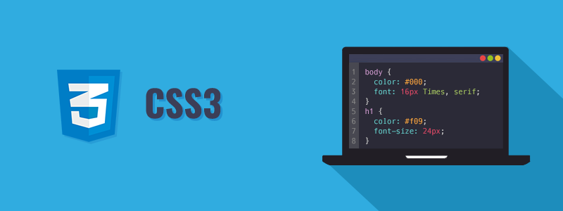

# Arquitetura CSS 

Trabalho desenvolvido durante curso de arquitetura da Alura ministrado pelo instrutor Matheus Castiglioni.

## Sobre o projeto

Nesse projeto desenvolvemos a página inicial de um site de receitas em que incluimos:

- Cabeçalho;
- Banner;
- Seção Sobre;
- Listagem de receitas;
- Seção *Quem somos, com as pessoas envolvidas na empresa;
- Rodapé com informações de contatos.

Usamos também algumas boas práticas de CSS, como a metodologia Atomic Design e conheceremos metodologias de nomenclatura das classes, de modo a mantermos um padrão.

Também deixamos o site responsivo, se adaptando às alterações de tela e mantendo seu padrão em celular, tablet ou desktop.

## Atomic Design 

Nesse projeto foi utilizada a metodologia do Atomic Design para organizar o CSS. Esse é um conceito criado por Brad Frost, que traz um jeito de analisar o que produzimos a partir de categorias que vão agregando cada vez mais componentes de uma forma lógica a partir do átomo.

## Confira uma prévia do projeto

